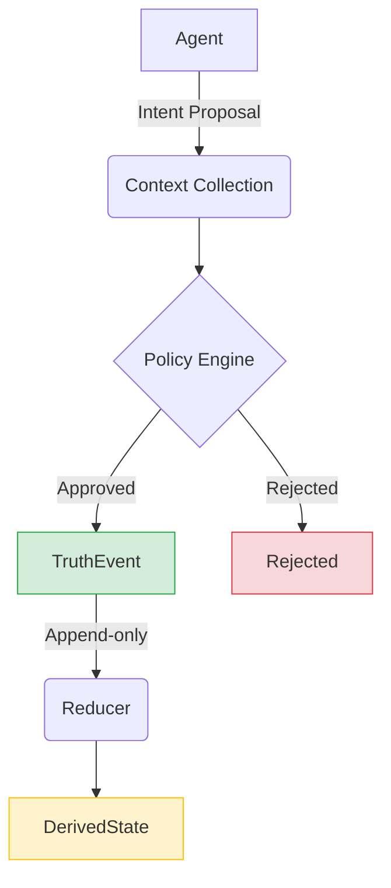

# OpenKedge

**Governing Real-World State in Agentic Systems via Intent-Based Mutation**

---

## 🧠 Overview

OpenKedge is a protocol for safely managing **real-world state mutation** in systems operated by autonomous AI agents.

Modern systems assume that callers are:
- **Correct**: They know exactly what change to make.
- **Context-aware**: They understand the current state and surroundings.
- **Operating independently**: There are no conflicting actors.

These assumptions break down in **agentic environments**, where multiple agents act under uncertainty. This leads to conflicting updates, context-insensitive actions, and unsafe mutations.

OpenKedge addresses this by introducing a **governance layer** between agents and system state.

---

## 🔥 Key Idea

> **Mutation should not be executed — it should be decided.**

Instead of the traditional direct-mutation model:

```text
Agent → API → Mutate State
```

OpenKedge introduces a mediated flow:

```text
Agent → Intent → Context → Policy → Event → Derived State
```

Every change is proposed, evaluated, approved (or rejected), and then committed as an immutable event.

---

## ⚙️ Core Concepts

### 1. Intent-Based Mutation

Agents do not mutate state directly—they submit **intent proposals**.

```ts
type IntentProposal = {
  actor: Actor;      // Who is proposing
  target: Entity;     // What is being changed
  intent: string;     // The goal (e.g. "update_status")
  proposedFacts: Fact[]; // The proposed truth
  metadata: Record<string, any>;
}
```

### 2. Fact-Based Truth Model

State is not stored as a static record. It is derived from structured **facts**.

```ts
type Fact = {
  type: string;
  value: any;
  attributes: Record<string, any>;
  validity: { from: string; to: string };
}
```

*Example:* `operating_status = open`, `inventory_status(croissant) = sold_out`.

### 3. Append-Only Event Log

Approved updates become immutable **TruthEvents**. The system state at any point is a projection of these events.

```bash
State = Reduce(events)
```

```ts
type TruthEvent = {
  entity: string;
  facts: Fact[];
  source: Actor;
  timestamp: string;
}
```

### 4. Policy-Governed Mutation

All updates pass through a policy engine that evaluates the proposal against the current system context.

```text
Policy(Proposal, Context) → { approve | reject | escalate }
```

No approval → no mutation. This ensures that even "hallucinating" agents cannot corrupt the system state.

### 5. Multi-Agent Coordination

OpenKedge resolves conflicts using a deterministic authority model:
* **Authority**: Owner updates always override agent proposals.
* **Trust**: Reliability scores influence decision making.
* **Time**: Recency helps resolve temporal conflicts.

---

## 🔄 Truth Flow



---

## 🧪 What This Solves

OpenKedge eliminates entire classes of failures common in agentic systems:

| Problem | API Systems | OpenKedge |
| :--- | :---: | :---: |
| **Conflicting updates** | ❌ | ✅ |
| **Context awareness** | ❌ | ✅ |
| **Safe mutation** | ❌ | ✅ |
| **Determinism** | ❌ | ✅ |
| **Auditability** | ❌ | ✅ |

---

## 🏗️ Reference Implementation: Riftront

OpenKedge is implemented in **[Riftront](https://riftront.com)**, a system that manages real-time business state:

* **Owners** update via high-level messaging (e.g., “closing early”).
* **Agents** propose updates (inventory, hours, etc.) based on observations.
* **System** resolves conflicts and maintains a consistent source of truth for the business.

This demonstrates the protocol's real-world applicability in multi-agent, high-stakes environments.

---

## 🧭 Why OpenKedge Matters

Agent systems are rapidly moving from **prototypes → production** and from **human control → autonomous operation**. However, our current infrastructure (REST/gRPC APIs) was designed for human-driven, context-aware clients.

OpenKedge introduces a new abstraction: **State mutation as a governed decision process.**

This is as fundamental to the agentic era as databases introducing transactions were to the mainframe era, or distributed consensus was to cloud computing.

---

## 📄 Paper

> **OpenKedge: Governing Real-World State in Agentic Systems via Intent-Based Mutation**

*Coming soon to arXiv*

---

## 🚀 Getting Started (Conceptual)

```ts
const proposal = {
  actor: "agent",
  target: "bakery_123",
  intent: "update_status",
  proposedFacts: [
    { type: "operating_status", value: "closed" }
  ]
}

const decision = Policy(proposal, context)

if (decision === "approve") {
  appendEvent(proposal)
}
```

---

## 🔒 Guarantees

OpenKedge ensures:
* **No unsafe mutation**: All changes are validated by policy first.
* **Deterministic state**: The state is a reproducible reduction of events.
* **Full auditability**: Every change has a clear actor, intent, and context.
* **Multi-agent safety**: Built-in conflict resolution for overlapping actors.
* **Context-aware decisions**: Policies can see the "whole picture" before committing.

---

## 🧠 Design Principles

* Separate **intent** from **execution**.
* Treat mutation as a **decision**.
* Represent truth as **events + facts**.
* Ensure **determinism and reproducibility**.

---

## 🛣️ Roadmap

- [ ] **Core protocol specification** (v0.1)
- [ ] **Policy DSL**: A domain-specific language for defining governance rules.
- [ ] **Multi-entity coordination**: Transactions across multiple stateful components.
- [ ] **Distributed OpenKedge clusters**: Scalable, high-availability event logs.
- [ ] **Integration with agent frameworks**: Standard adapters for LangChain, AutoGPT, etc.

---

## 🤝 Contributing

We welcome contributions in:
* Policy engine design
* Schema and data modeling
* Distributed systems architecture
* Agent framework integrations

---

## 📬 Contact

**Joe Helium**  
OpenKedge.io  
[joehelium@openkedge.io](mailto:joehelium@openkedge.io)

---

## ⭐️ Vision

OpenKedge aims to become **the standard protocol for governing how AI agents interact with real-world systems.**

---

```text
State mutation is too dangerous to be left to chance. 
OpenKedge makes it a governed decision.
```
