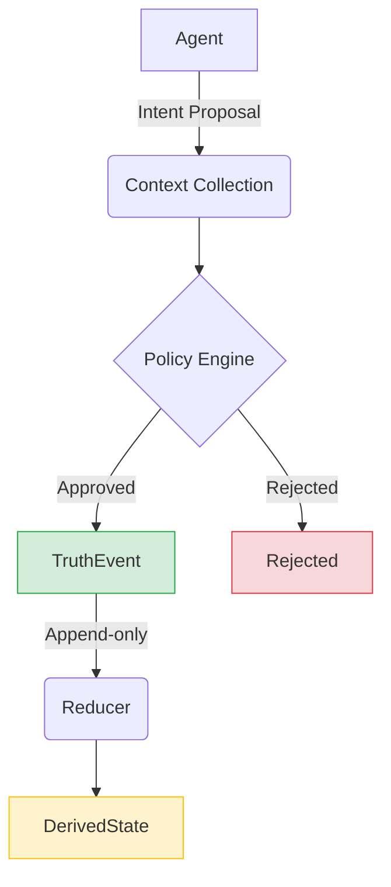
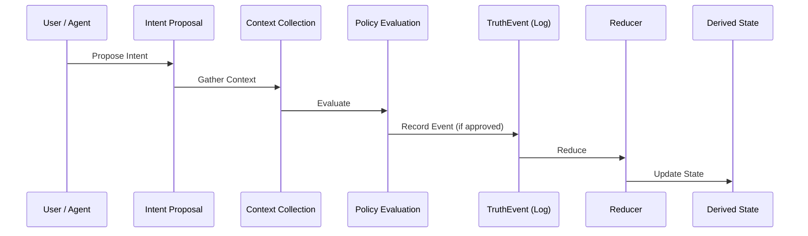
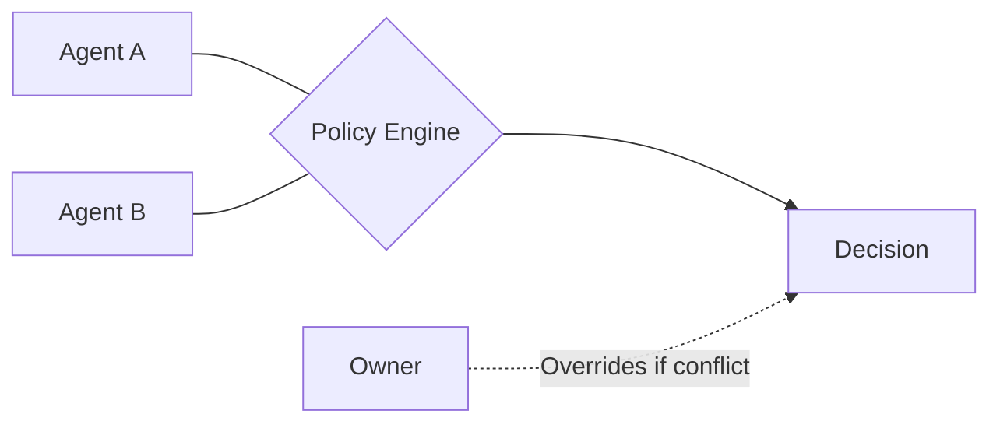

# 🧠 OpenKedge

> **Intent-based protocol for safe, context-aware mutation in agentic systems**

---

## ⚡ TL;DR

Modern AI agents interact with real-world systems through APIs. 

That model is breaking.

**OpenKedge replaces direct mutation with:**

```text
Intent → Context → Policy → Event → Derived State
```

Agents no longer mutate systems directly. 
They **propose intent**, and the system determines whether it becomes truth.

---

## 🚨 The Problem

Today’s systems rely on a flawed assumption:

```text
Agent → API → Mutation
```

This assumes:
* the caller is correct
* the caller has full context
* no conflicting agents exist

❌ In agentic environments, this breaks:
* agents hallucinate
* multiple agents conflict
* mutations are unsafe and irreversible
* no audit or governance layer exists

---

## ✅ The OpenKedge Model



---

## 🧱 Core Concepts

### 1. IntentProposal

Agents do not mutate state directly—they submit intent.

```ts
type IntentProposal = {
  id: string;

  actor: Actor;
  target: EntityRef;

  intent: string;

  payload: {
    proposedFacts: Fact[];
  };

  metadata?: {
    reason?: string;
    traceId?: string;
  };

  createdAt: string;
};
```

---

### 2. Actor

Defines who is making the proposal.

```ts
type Actor = {
  id: string;

  type: 
    | "owner" 
    | "verified_agent" 
    | "unverified_agent" 
    | "system";

  trustLevel: number; // 0–1
};
```

---

### 3. Fact (Composable Truth)

The atomic unit of truth.

```ts
type Fact = {
  type: string;
  value: any;

  item?: string;

  validFrom?: string;
  validTo?: string;

  priority?: number;
};
```

**Examples:**
* `operating_status = open`
* `closing_time_override = 15:00`
* `inventory_status(item=croissant) = sold_out`

---

### 4. TruthEvent (Append-only)

All approved mutations become immutable events.

```ts
type TruthEvent = {
  id: string;
  
  entity: EntityRef;

  facts: Fact[];

  source: Actor;

  createdAt: string;

  schemaVersion: "v2";
};
```

---

### 5. DerivedState

State is never written—only computed.

```ts
type DerivedState = {
  facts: Fact[];

  computed: {
    isOpen?: boolean;
    closesAt?: string;
    inventory?: Record<string, string>;
  };

  confidence: "explicit_owner" | "fallback" | "expired";

  lastUpdated: string;
};
```

---

## 🔄 Truth Flow



---

## ⚖️ Policy Engine

All mutations are governed.

```ts
if (actor.type === "owner") {
  approve();
}

if (actor.type === "verified_agent") {
  if (conflictsWithRecentOwnerUpdate) reject();
  else approve();
}

if (actor.type === "unverified_agent") {
  escalate();
}
```

---

## 🔐 Authority Model

Conflict resolution is deterministic:

```text
owner > verified_agent > system > unverified_agent
```

---

## 🔄 Multi-Agent Coordination



---

## 🔌 Query Interface

```http
POST /openkedge/query
```

```json
{
  "intent": "check_open",
  "entity": { "id": "cafe-luna" }
}
```

**Response:**

```json
{
  "result": { "isOpen": true },
  "confidence": "explicit_owner",
  "explanation": "Owner updated status recently",
  "source": {
    "lastUpdated": "...",
    "actor": "owner"
  }
}
```

---

## 🌍 Discovery Interface

```http
POST /openkedge/discover
```

```json
{
  "intent": "find_open",
  "filters": {
    "type": "cafe",
    "location": "Seattle"
  }
}
```

---

## 🧠 Key Insight

> APIs expose *how to mutate*
> OpenKedge exposes *whether mutation should happen*

---

## 📜 Protocol Invariants

* ✅ **No direct mutation**
* ✅ **All changes go through intent → policy → event**
* ✅ **Truth is append-only**
* ✅ **State is derived, never stored**
* ✅ **Deterministic resolution**

---

## 🛍️ Reference Implementation: [Riftront](https://riftront.com)

**Real-time storefront system powered by OpenKedge**

* Business owners send updates via message
* System converts to structured facts
* Agents query real-time truth

---

## 🚀 Use Cases

* **Local business real-time state** (Riftront)
* **Cloud infrastructure mutation safety**
* **DevOps automation**
* **IoT / physical systems**
* **Financial systems**

---

## 🔮 Roadmap

* `v0.2` → Richer policy language
* `v0.3` → Multi-agent negotiation
* `v0.4` → Streaming subscriptions
* `v1.0` → Production-ready protocol

---

## 📄 Paper (in progress)

> **Intent-Based Governance for Real-Time Truth Systems in Agentic Environments**

---

## ⭐ If this resonates

* **Star the repo**
* **Follow development**
* **Try Riftront**

---

# 🧠 Final Note

OpenKedge is not a framework. 
It is not a workflow engine.

> It is a **new abstraction for governing real-world state in the agentic era**.

---
