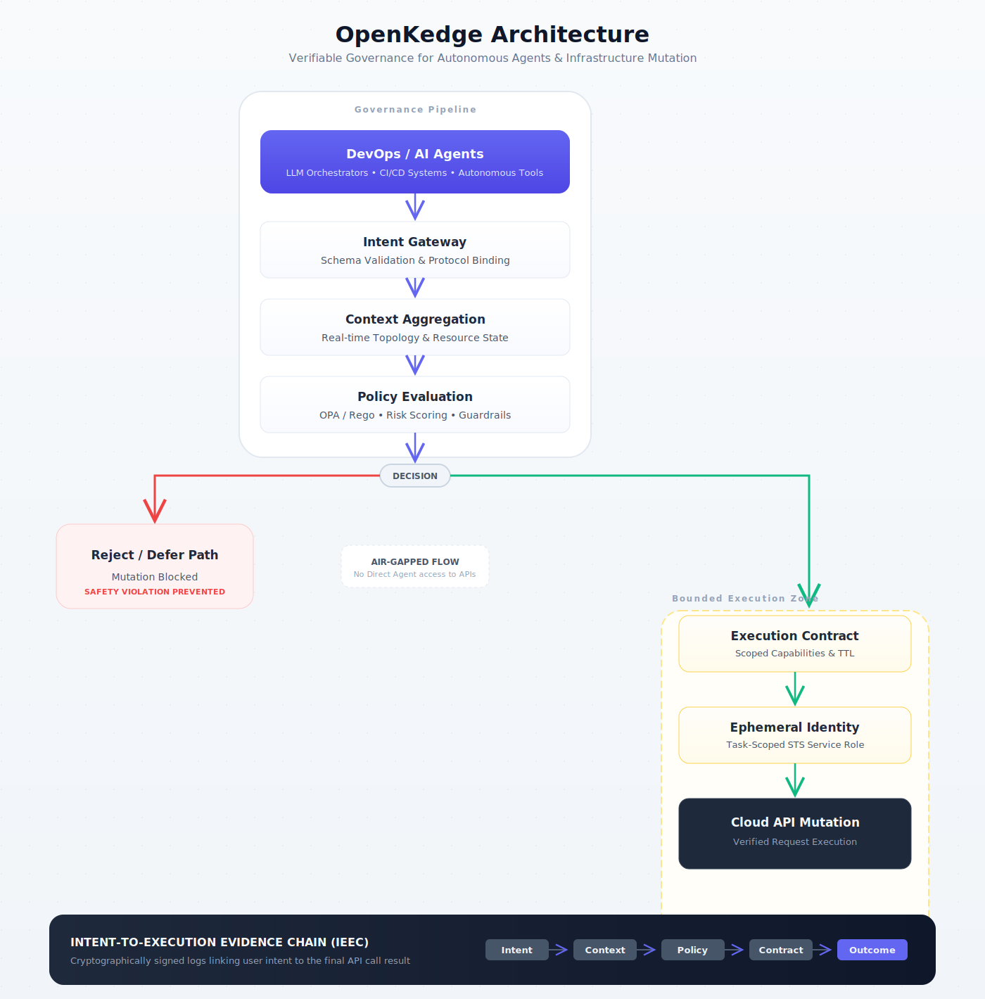

# OpenKedge

> Governing Agentic Mutation with Execution-Bound Safety and Evidence Chains

OpenKedge is a protocol for safely operating AI agents over real-world systems.

It replaces direct API execution with:
- **intent-governed mutation**
- **execution-bounded contracts**
- **verifiable decision lineage (IEEC)**

---

## 🚨 Why OpenKedge?

Modern infrastructure is built on assumptions that no longer hold:

- callers are deterministic  
- actions are correct  
- context is complete  

This breaks in the era of AI agents.

Today’s model:

```text
Agent → API → Immediate Mutation
````

Leads to:

* unsafe deletions (e.g., terminating live infrastructure)
* conflicting multi-agent updates
* context-blind automation
* cascading failures

👉 The issue is not just the model —
it’s the **mutation model**.

---

## 🔐 The OpenKedge Model

OpenKedge introduces a governed mutation pipeline:

```text
Intent → Context → Policy → Contract → Execution → Evidence Chain
```

---

### 1. Intent-Governed Mutation

Agents do not execute APIs directly.

They submit:

> what they want to achieve

The system evaluates:

* system-wide context
* dependencies
* policy constraints
* multi-agent conflicts

---

### 2. Execution-Bound Safety

Approved intents are compiled into **execution contracts**:

* allowed actions
* scoped resources
* strict time bounds

Execution is enforced via **ephemeral identities** (e.g., AWS STS).

Even if an agent hallucinates, execution is physically constrained.

---

### 3. Intent-to-Execution Evidence Chain (IEEC)

Every mutation produces a **verifiable lineage**:

```text
Intent → Context → Policy → Contract → Execution → Outcome
```

Properties:

* cryptographically linked
* temporally ordered
* fully reconstructable

This enables:

* auditability
* explainability
* forensic debugging

👉 Not just *what happened*, but *why it was allowed*

---

## 🧠 Core Insight

> Mutation should not be executed. Mutation should be governed.

---

## 📄 Paper

Read the full paper:

* [openkedge.io/paper](https://www.openkedge.io/paper)

---

## 🏗 Architecture



Key guarantees:

* no direct agent → API execution path
* all mutations pass governance
* execution is strictly bounded
* every step is recorded in IEEC

---

## 🧪 Example: Safe Instance Termination

### ❌ Traditional: API-Driven Execution

A user tells an AI agent to terminate 2 EC2 instances. The agent immediately invokes the AWS API:

```text
Action: ec2:TerminateInstances
Instances: [i-0123456789abcdef0, i-0abcdef1234567890]
```

**The problem:** If you look at AWS CloudTrail, you only see that the `ec2:TerminateInstances` API was called. The original user request, the agent's context, and any safety checks (or lack thereof) are never logged. You only see what eventually happened, even if the instances were actively serving production traffic.

---

### ✅ OpenKedge: Intent-Governed Mutation

OpenKedge forces the AI agent to start from an "intent" and enforces safety checks through policies prior to execution. Everything is recorded in a cryptographically chained log.

**1. Intent Submission**
The agent cannot call the API directly. It submits an intent:

```json
{
  "action": "terminate_instances",
  "reason": "User requested cleanup of idle environments",
  "targets": ["i-0123456789abcdef0", "i-0abcdef1234567890"]
}
```

**2. Context & Policy Evaluation**
OpenKedge evaluates the blast radius against live infrastructure state:
* **Context:** Are these instances receiving traffic from an active Load Balancer?
* **Policy:** Does the agent have permissions to terminate instances lacking the `env:dev` tag?

**3. Execution Contract Generation**
If approved, OpenKedge generates an immutable execution contract and issues highly-scoped, temporary credentials (e.g., via AWS STS) that *only* permit terminating those exact two instances within a 5-minute window.

**4. Bounded Execution**
The mutation occurs. Even if the agent goes rogue, the physical execution is bounded by the credentials—it cannot terminate a third instance.

**5. Intent-to-Execution Evidence Chain (IEEC)**
Instead of an isolated CloudTrail API event, OpenKedge produces a cryptographically sealed chain:

```text
[Hash1: Intent] → [Hash2: Context] → [Hash3: Policy Approval] → [Hash4: Contract] → [Hash5: Execution Event]
```

You have complete forensic visibility into *why* the mutation was allowed, not just that it happened.

---

## 🚀 Getting Started

```bash
git clone https://github.com/openkedge/openkedge
cd openkedge
npm install
```

### Running the Interactive Demo

Experience the OpenKedge safety guarantees in real-time by running the full-stack interactive demo locally. The demo overlays an automated agent attempting a destructive mutation against a mocked context.

You will need two terminals.

**Terminal 1: Start the API Engine (Backend)**
```bash
cd apps/demo-server
npm run dev
```

**Terminal 2: Start the Replay Visualizer (Frontend)**
```bash
cd apps/replay-ui
npm run dev
```

1. Navigate to `http://localhost:5173/` in your browser.
2. Click **Run Outage Simulation**  
3. Watch the visual timeline demonstrate how the mutation is intercepted, contextualized, and blocked dynamically.

> ⚠️ Early-stage reference implementation

---

## 🧩 Use Cases

* AI-driven DevOps automation
* multi-agent systems
* cloud infrastructure safety
* workflow engines with AI integration
* autonomous system governance

---

## 🔬 Key Contributions

* intent-governed mutation protocol
* execution-bound safety via contracts
* IEEC: verifiable mutation lineage

---

## 📜 RFCs & Governance

OpenKedge is governed by a formal RFC process to ensure protocol stability and multi-agent interoperability.

* **[RFC Index](./rfcs/README.md)**: Browse all RFCs, architectural standards, and protocol specifications.
* **[Intent Governance Protocol (IGP)](./rfcs/0001-intent-governance-protocol.md)**: Our primary specification for intent-based safety.
* **[Event Evidence Chain (EEC)](./rfcs/0002-event-evidence-chain.md)**: The mathematical model for verifiable mutation lineage.
* **[Execution Identity (EI)](./rfcs/0003-execution-identity.md)**: The ephemeral, intent-scoped security primitive.
* **[Protocol Schemas](./schemas/)**: Machine-readable definitions for Intents and Evidence Chains.

---

## 🛣 Roadmap

* [ ] Core protocol (v0.1)
* [ ] AWS adapter (STS + policy integration)
* [ ] Policy engine plugins (Cedar / OPA)
* [ ] Multi-agent simulation framework
* [ ] IEEC visualization UI
* [ ] Production SDK

---

## 🤝 Contributing

We welcome contributions across:

* policy engines
* cloud adapters
* agent integrations
* visualization tools

---

## 📜 License

MIT (or TBD)

---

## 🌍 Vision

As AI agents become primary operators of infrastructure,
the correctness of individual agents becomes secondary to the correctness of the system governing them.

OpenKedge provides that foundation.

---

## ⭐ If this resonates

Star the repo and follow the project.

This is just the beginning.
